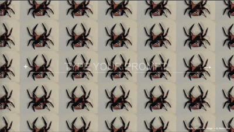

# ✨ BeyondOrigami

An **image-to-image reimagination app** that transforms your photos into stylized origami-inspired artwork using Stable Diffusion (DreamShaper LCM) with a custom LoRA — all powered by ComfyUI on the backend.

Upload an image, type a prompt, and watch it transform in near real-time.

<p align="center">
  
</p>

---

## ✨ Features

- **Image-to-Image Generation** — Upload any image and reimagine it with a text prompt
- **Near Real-Time** — Uses LCM (Latent Consistency Model) for fast 2-step inference
- **Drag & Drop** — Drop images directly onto the input bar
- **Surprise Dice 🎲** — Creates a 2×3 collage from your past generations
- **Generation History** — Automatically saves all outputs to browser local storage
- **Custom LoRA Style** — Applies the Lorena Style LoRA for a unique aesthetic

---

## 🛠️ Tech Stack

| Layer | Technology |
|-------|-----------|
| **Frontend** | Vanilla HTML/CSS/JS (Single Page App) |
| **Backend** | Python, FastAPI, Uvicorn |
| **AI Engine** | ComfyUI with WebSocket API |
| **Model** | DreamShaper8_LCM (Stable Diffusion) |
| **LoRA** | Lorena_Style |
| **Sampler** | LCM, 2 steps, 0.4 denoise |

---

## 📋 Prerequisites

1. **Python 3.10+**
2. **ComfyUI** — installed and running locally on `127.0.0.1:8188`
3. **Model files** (placed in ComfyUI's respective directories):
   - `DreamShaper8_LCM.safetensors` — in `models/checkpoints/`
   - `Lorena_Style.safetensors` — in `models/loras/`
4. **ComfyUI Custom Nodes** (required):
   - [ComfyUI-SaveImageWebsocket](https://github.com/comfyanonymous/ComfyUI) — `SaveImageWebsocket` node
   - [ETN_LoadImageBase64](https://github.com/elldritch/ComfyUI-ETN) — for loading base64 images

---

## 🚀 Getting Started

### 1. Clone the repository

```bash
git clone https://github.com/<your-username>/beyondorigami.git
cd beyondorigami
```

### 2. Create a virtual environment & install dependencies

```bash
python -m venv venv
source venv/bin/activate    # On Windows: venv\Scripts\activate
pip install -r requirements.txt
```

### 3. Start ComfyUI

Make sure ComfyUI is running on `http://127.0.0.1:8188` with the required models loaded.

### 4. Start the FastAPI server

```bash
uvicorn main:app --reload --port 8000
```

### 5. Open the app

Open `index.html` in your browser (or serve it via a local server).

---

## 📁 Project Structure

```
beyondorigami/
├── main.py                    # FastAPI server (POST /get-image)
├── comfyuiservice.py          # ComfyUI WebSocket integration
├── image_image_lcm_api.json   # ComfyUI workflow definition
├── index.html                 # Frontend UI
├── requirements.txt           # Python dependencies
├── static/
│   └── style.css              # Styles
├── templates/
│   └── demo_imgs/             # Sample input images
│       ├── butterfly.png
│       └── spider.png
└── .gitignore
```

---

## 🔄 How It Works

```
Browser                    FastAPI                     ComfyUI
  │                          │                           │
  │── Upload image ──────────│                           │
  │── Enter prompt ──────────│                           │
  │── POST /get-image ──────>│                           │
  │                          │── WebSocket connect ─────>│
  │                          │── Queue workflow ────────>│
  │                          │                           │── Run LCM img2img
  │                          │<── Generated image ───────│
  │<── PNG stream ───────────│                           │
  │── Display as background  │                           │
  │── Save to localStorage   │                           │
```

---

## ⚡ Performance

> Benchmarked using [`benchmark.py`](benchmark.py) on a local machine with ComfyUI.

| Metric | Value |
|--------|-------|
| Inference time (warm) | **~2.1s** |
| Cold start (first run, model loading) | ~24s |
| Resolution | 512×512 |
| Sampler | LCM (2 steps) |
| Denoise strength | 0.4 |
| Model | DreamShaper8_LCM |
| LoRA | Lorena_Style (strength 1.0) |

> **Note:** The first generation takes ~24s as ComfyUI loads the checkpoint + LoRA into memory. Subsequent generations run in ~2s.

---

## 📝 Usage

1. Click the **+** button or drag & drop an image onto the input area
2. Type your reimagination prompt (e.g., "origami crane in a zen garden")
3. Click **→** to generate
4. The transformed image appears as the fullscreen background
5. Generate 6+ images, then click **Surprise Dice** for a collage
6. Click **📥 Download** to save the collage

---

## 📄 License

This project is open source. Feel free to use and modify.
